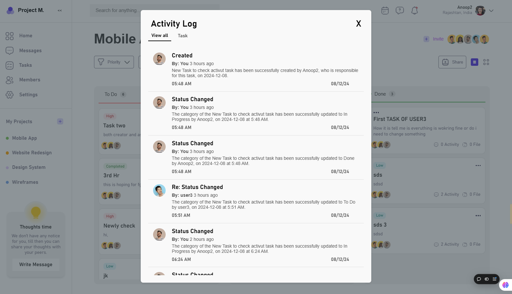
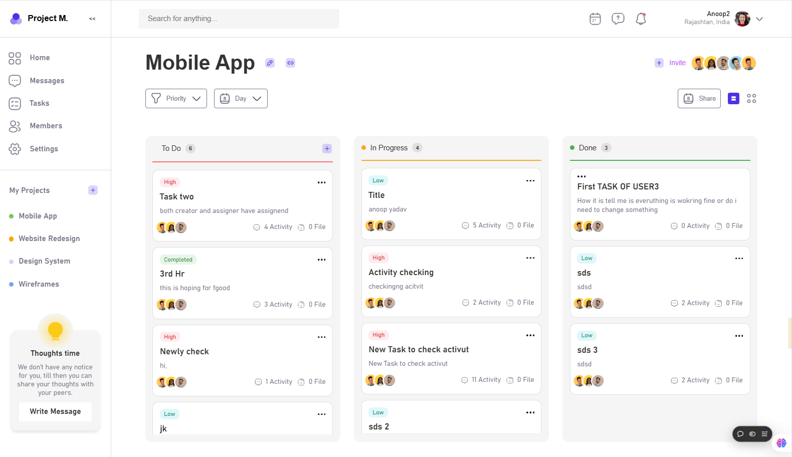

# Task Management System 📝

A task management system where users can register, create tasks, assign them to different users, and manage them efficiently with features like filtering, drag-and-drop task status updates, and real-time activity logs.

[Live](https://upaay-assignment.vercel.app/)

[View Video](https://drive.google.com/file/d/1VjJwMr_4yhYuBpc61_Q_1tVJwkPV0xmv/view?usp=sharing)

## Features ✨
- **User Registration & Authentication** 🔐  
  Users can register themselves to the platform and log in to access their dashboard.
  
- **Task Creation & Assignment** 🛠️  
  Users can create tasks and assign them to other users.

- **Filter Tasks by Priority & Due Date** 🔎  
  You can filter tasks based on priority and due date for better management.

- **Drag & Drop Task Management** 🖱️  
  Drag tasks from one category to another based on the status (e.g., To Do, In Progress, Done).

- **Real-Time Activity Log** 🕒  
  Track all user activity in real-time to stay updated with ongoing tasks.

---

## Screenshots 📸

  
_Screenshot of the task management dashboard._

  
_Screenshot of the task creation form._


---

## Tech Stack 💻
- **Frontend**: React.js, Redux
- **Backend**: Node.js, Express
- **Database**: MongoDB
- **Real-time**: Socket.io
- **Authentication**: JWT (JSON Web Token)

---

## Installation Instructions 🛠️

### Prerequisites
Before you begin, ensure you have the following installed on your local machine:

- **Node.js** (v14 or above)  
  Install Node.js from [nodejs.org](https://nodejs.org/).

- **MongoDB** (local or cloud)  
  Set up MongoDB locally or create a cloud instance using [MongoDB Atlas](https://www.mongodb.com/cloud/atlas).

### Steps to Run Locally 🚀

### 1️⃣ Clone the Repository
Clone the repository to your local machine by running the following command:

```bash
$ git clone https://github.com/Vicky8180/Upaay_Assignment
$ cd Upaay_Assignment
```

### 2️⃣ Install Dependencies for frontend
```bash
$ npm install
```

### 3 Install Dependencies for backend
```bash
$ npm install
```
### 4 Environment variables configured in .env file for both frontend and backend
```bash
REACT_APP_BASE_URL_PORT="your backend server this is FOR FRONTEND .ENV" 
JWT_SECRET_KEY=<"SECRECT_key this is FOR BACKEND .ENV">
PORT=<" this is FOR BACKEND .ENV">
MONGO_URL=<" MONGO_URL is FOR BACKEND .ENV">
```

### 5 Start the Development Server
```bash
$ npm start
```
The app will be available at `http://localhost:3000`.

### 6 Build for Production
```bash
$ npm run build
```
Your optimized app will be in the `build/` directory.

---

## Usage 📊

- **Register**:  
  Click on the "Register" button to create a new account.

- **Login**:  
  After registration, log in with your credentials to access the dashboard.

- **Create a Task**:  
  Click on the "Create Task" button, fill in the task details (e.g., title, description, due date, priority), and assign it to a user.

- **Filter Tasks**:  
  Use the filters to sort tasks based on priority, due date, or status.

- **Drag & Drop**:  
  You can move tasks from one status category to another (e.g., from "To Do" to "In Progress" or "Completed").

- **Activity Log**:  
  View the real-time activity log that tracks user actions such as task creation, updates, and status changes.

---

## Contributing 🤝

We welcome contributions! To contribute:

1. Fork the repository.
2. Create a new branch (`git checkout -b feature-name`).
3. Make your changes and commit them (`git commit -am 'Add feature'`).
4. Push to the branch (`git push origin feature-name`).
5. Open a Pull Request to the main repository.

---

## License 📄

This project is licensed under the MIT License - see the [LICENSE](LICENSE) file for details.

---

## Acknowledgements 🙏

- Icons made by [FontAwesome](https://fontawesome.com) and [Flaticon](https://www.flaticon.com).
- [React.js](https://reactjs.org/)
- [Socket.io](https://socket.io/)
- [Node.js](https://nodejs.org/)
- [MongoDB](https://www.mongodb.com/)
